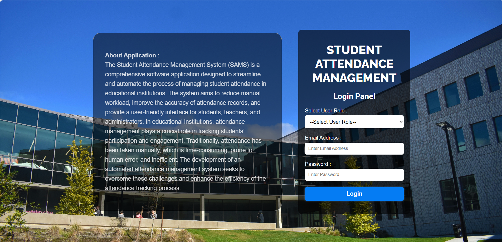
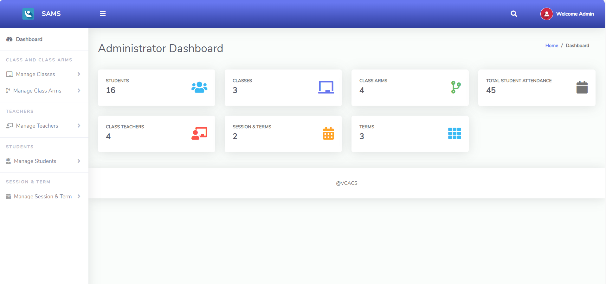

# Student-Attendance-Management-System
This PHP attendance system project is primarily concerned with dealing with students' attendance and records. In addition, the system displays all available data, such as instructor and student information, as well as their individual attendance. Admin Panel, Student Panel, and Teacher's Panel are the three sections of the project. In this web app's overview, the administrator has the ability to create users as well as insert student and teacher data. In terms of the project, the administrator has access to all student and teacher records. The teacher's account allows him or her to filter student data and keep track of his or her attendance for a certain subject. Aside from that, the student has access to just records and attendance reports.

**Admin Login Details**
* Email   : admin@mail.com
* Password: Password@123

**Teacher Login Details**

* Email   : teacher@mail.com
* Password: pass123

#

#

#

#

#

#

#

#

#

#

